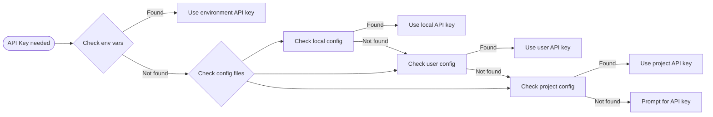

# Claude Code Control Flow

## Main Control Flow Diagram

```mermaid
graph TB
    Start([User runs 'claude' command]) --> Wrapper[claude-restart.sh wrapper]
    
    Wrapper --> CLI[cli.js Entry Point]
    
    CLI --> Parser[Commander.js parses arguments]
    
    Parser --> CheckMode{Interactive or Command?}
    
    CheckMode -->|Command Mode| Command[Execute specific command]
    CheckMode -->|Interactive Mode| Interactive[Start REPL/Interactive Session]
    
    Command --> ConfigCmd[config command]
    Command --> MCPCmd[mcp command]
    Command --> MigrateCmd[migrate-installer command]
    Command --> DoctorCmd[doctor command]
    Command --> UpdateCmd[update command]
    
    Interactive --> UI[React/Ink UI Components]
    UI --> Input[Handle user input]
    Input --> SlashCheck{Slash command?}
    
    SlashCheck -->|Yes| SlashCmd[Process slash command]
    SlashCheck -->|No| Process[Process regular input]
    
    SlashCmd --> Help[/help]
    SlashCmd --> Init[/init]
    SlashCmd --> MCPStatus[/mcp]
    SlashCmd --> PRComments[/pr-comments]
    
    Process --> Tools[Execute tools]
    Tools --> ToolExec[Tool execution]
    
    ToolExec --> ExitCheck{Check exit code}
    ExitCheck -->|42| RestartResume[Restart with 'resume 0']
    ExitCheck -->|43| RestartTool[Tool restart 'Keep going..']
    ExitCheck -->|Other| Cleanup[Cleanup and exit]
    
    RestartResume --> Wrapper
    RestartTool --> Wrapper
    
    ConfigCmd --> ConfigStore[Read/Write config files]
    MCPCmd --> MCPServers[Manage MCP servers]
    MigrateCmd --> LocalInstall[Migrate to local installation]
    DoctorCmd --> HealthCheck[Check installation health]
    UpdateCmd --> AutoUpdate[Check and install updates]
```

## Authentication Flow



## Tool Execution Flow


## Configuration Management Flow


## MCP Server Management Flow

